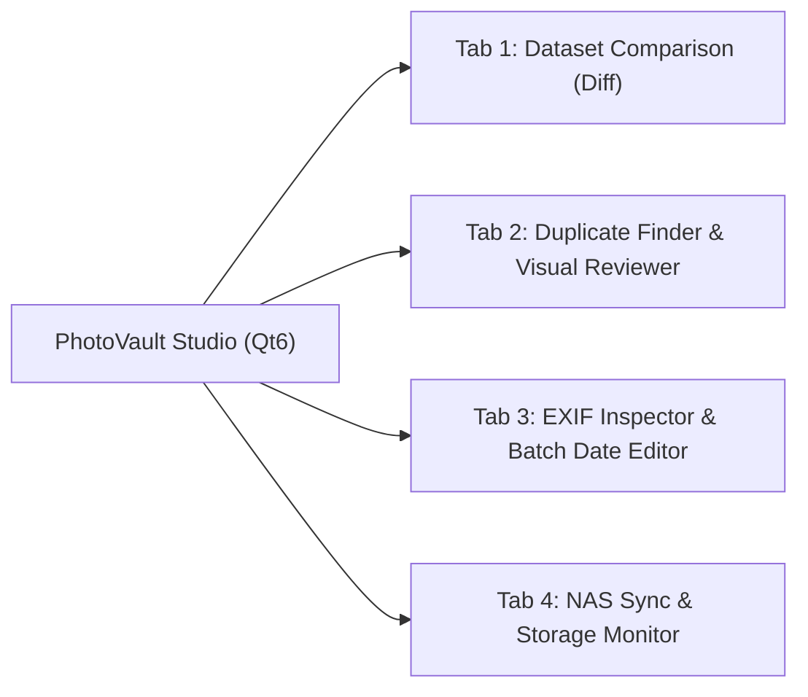

# PhotoSynApp: Google Photos Backup, Deduplication & Scanning Operations Guide

> **Author**: Paul Carff & AI Engineering Pair  
> **Systems**: Cortex Workstation (72 Xeon Cores, 190 GB RAM, NVMe) & Synology NAS (`10.19.5.11`)  
> **Repository**: `/workspaces_nvme/PhotoSynApp` & `~/CODE/PhotoSynApp`  
> **Operational Mode**: **Option A (Manual On-Demand)** + **Cortex Local Vault & Qt6 GUI**  
> **Status**: Verified & Operational  
> **Last Updated**: September 2026  

---

## Table of Contents
1. [The Three Photo Libraries (Architecture Overview)](#1-the-three-photo-libraries-architecture-overview)
2. [Albums & Favorites Preservation](#2-albums--favorites-preservation)
3. [Operating Policy: Option A (Manual On-Demand)](#3-operating-policy-option-a-manual-on-demand)
4. [Cortex Workstation Architecture: The Heavy Workhorse & Local Vault](#4-cortex-workstation-architecture-the-heavy-workhorse--local-vault)
5. [PhotoVault Studio (Qt6 Desktop GUI Application)](#5-photovault-studio-qt6-desktop-gui-application)
6. [Key Code Improvements & Bug Fixes](#6-key-code-improvements--bug-fixes)
7. [Operating Runbook: Paul's Google Photos Backup (Combined/All)](#7-operating-runbook-pauls-google-photos-backup-combinedall)
8. [Operating Runbook: Laura's Google Photos Backup (Isolated/Laura-Only)](#8-operating-runbook-lauras-google-photos-backup-isolatedlaura-only)
9. [Recurring Monthly Cycles: What Happens Next?](#9-recurring-monthly-cycles-what-happens-next)
10. [Deduplication Deep Dive: Binary Hashes vs. Image Matching](#10-deduplication-deep-dive-binary-hashes-vs-image-matching)
11. [Legacy Family Photo Scanning Guide](#11-legacy-family-photo-scanning-guide)
12. [System Maintenance, Monitoring & Troubleshooting](#12-system-maintenance-monitoring--troubleshooting)
13. [Quick Reference Cheat Sheet](#13-quick-reference-cheat-sheet)

---

## 1. The Three Photo Libraries (Architecture Overview)

Your photo ecosystem is organized into **three distinct photo groups**, replicated between the Synology NAS and the Cortex workstation:

```mermaid
flowchart TD
    subgraph SynologyNAS["Synology NAS (/volume1)"]
        P_NAS["/volume1/PhotoSync/ALL_PHOTOS/<br/>(Paul Combined / All)"]
        L_NAS["/volume1/PhotoSync/Laura/ALL_PHOTOS/<br/>(Laura Only)"]
        H_NAS["/volume1/Photos/<br/>(Historical Master 1984-2020)"]
    end

    subgraph CortexVault["Cortex Workstation (/Workspaces/Photos)"]
        P_CTX["/Workspaces/Photos/Paul_Combined/"]
        L_CTX["/Workspaces/Photos/Laura_Only/"]
        H_CTX["/Workspaces/Photos/Historical_Master/"]
    end

    subgraph Tools["Cortex Compute & GUI Powerhouse"]
        GUI["PhotoVault Studio (Qt6 GUI)<br/>├── Dataset Comparison (Diff)<br/>├── Perceptual Deduplication (pHash)<br/>├── EXIF Header & Date Editor<br/>└── Live NAS Sync Manager"]
    end

    P_NAS <-->|High-Speed rsync (85-110 MB/s)| P_CTX
    L_NAS <-->|High-Speed rsync (85-110 MB/s)| L_CTX
    H_NAS <-->|High-Speed rsync (85-110 MB/s)| H_CTX

    CortexVault --> Tools
```

### Summary of the Three Libraries

| Group | Path on Synology NAS | Path on Cortex Workstation | Scope & Contents |
| :--- | :--- | :--- | :--- |
| **1. Paul (All / Combined)** | `/volume1/PhotoSync/ALL_PHOTOS` | `/Workspaces/Photos/Paul_Combined` | **Combined Master Cloud Timeline**: Contains Paul’s full Google Photos archive plus Laura's takeout. 127,662 photos (~630 GB). |
| **2. Laura (Only)** | `/volume1/PhotoSync/Laura/ALL_PHOTOS` | `/Workspaces/Photos/Laura_Only` | **Laura's Dedicated Archive**: Strictly Laura's Google Photos collection in isolation. 54,198 photos (~252 GB). |
| **3. Old Photos (Historical Master)** | `/volume1/Photos` | `/Workspaces/Photos/Historical_Master` | **Historical Pre-Cloud Archive**: Pre-existing digitized family photos, slides, and cameras (1984–2020), plus new physical scans. ~953 GB. |

---

## 2. Albums & Favorites Preservation

Google Takeout captures your albums and favorited photos, and PhotoSynApp now explicitly preserves them without duplicating storage:

### 2.1 Album Preservation via Zero-Storage Symlinks (`--albums shortcut`)
* **How Takeout Exports Albums**: Google creates a separate folder for every album (e.g. `Takeout/Google Photos/Vacation 2019/`).
* **The Solution in PhotoSynApp**: We updated [`app/gpth_runner.py`](file:///workspaces_nvme/PhotoSynApp/app/gpth_runner.py) to use `--albums shortcut` and updated [`app/importer.py`](file:///workspaces_nvme/PhotoSynApp/app/importer.py) to replicate these symlinks:
  - Original photos are stored once in `ALL_PHOTOS/YYYY/MM/`.
  - An `Albums/` folder is maintained where each album contains lightweight symlinks pointing to the canonical photo:
    ```
    Albums/
    ├── Vacation 2019/
    │   └── IMG_1024.jpg -> ../../ALL_PHOTOS/2019/07/IMG_1024.jpg
    └── Favorites/
        └── IMG_2050.jpg -> ../../ALL_PHOTOS/2021/12/IMG_2050.jpg
    ```
* **Storage Footprint**: **0 extra bytes**.

### 2.2 Standard 5-Star Favorite Tagging
* **The JSON Sidecars**: Google exports `"favorited": true` inside every photo's `.json` metadata file.
* **Automatic EXIF Tagging**: Our new [`app/metadata_tagger.py`](file:///workspaces_nvme/PhotoSynApp/app/metadata_tagger.py) scans these sidecars during ingestion and writes standard EXIF metadata:
  $$\text{Rating} = 5 \quad (\text{Tag } 0x4746 / 18246)$$
* **Universal Support**: When viewed in Synology Photos, Apple Photos, Adobe Lightroom, DigiKam, or PhotoVault Studio, favorited photos automatically appear with **⭐⭐⭐⭐⭐** stars.

---

## 3. Operating Policy: Option A (Manual On-Demand)

* **Background Automated Polling is Disabled**: Prevents surprise cloud downloads, uncoordinated NAS disk I/O, or cross-folder confusion when shared folders are created in Google Drive.
* **On-Demand Control**: Ingestions are initiated manually using `--once` only when you or Laura generate a new Takeout.
* **No Unwanted Deletions**: An additive vault architecture guarantees that cloud deletions or curation in Google Photos will **never** delete files from the local or NAS libraries.

---

## 4. Cortex Workstation Architecture: The Heavy Workhorse & Local Vault

### 4.1 Hardware Advantages
Your workstation (`cortex`) provides:
* **72 Intel Xeon CPU cores** (Dual Xeon Gold 6154 @ 3.00 GHz)
* **190 GB of RAM**
* **1.4 TB NVMe Scratch Space** (`/workspaces_nvme`)
* **2.4 TB Local Storage** (`/Workspaces`)

### 4.2 Benefits of the Adjusted Flow
1. **10x Faster Ingestion**: Unpacking 260 GB multi-part archives and injecting EXIF metadata via `gpth` runs in **10–15 minutes** on Cortex NVMe instead of 2+ hours on spinning NAS disks.
2. **Instant 3-2-1 Redundancy**: You maintain a full, bit-for-bit identical replica of all three libraries locally on Cortex and remotely on the Synology NAS.
3. **High-Speed Network Mirroring**: Transferring between Cortex and Synology runs at wire speed (~85–110 MB/s) via [`scripts/sync_from_nas.sh`](file:///workspaces_nvme/PhotoSynApp/scripts/sync_from_nas.sh).

---

## 5. PhotoVault Studio (Qt6 Desktop GUI Application)

To manage, compare, deduplicate, and edit photo metadata with full visual control, we created **PhotoVault Studio**, a dedicated Qt6 application running natively on `cortex`.

```
Launch command:
/workspaces_nvme/PhotoSynApp/bin/photovault-gui
```



### 5.1 Tab 1: Dataset Comparison (Diff)
* **Purpose**: Compares any two directories (e.g. Paul Combined vs. Laura Only, or Local vs. NAS).
* **Metrics**: Calculates exact counts of:
  - *Only in Folder A*
  - *Only in Folder B*
  - *Identical in Both*
  - *Modified (Different file size or SHA-256 hash)*
* **Interactive Table**: Search by filename or relative folder path, filter by status, and export detailed CSV reports.

### 5.2 Tab 2: Duplicate Finder & Side-by-Side Visual Reviewer
* **Dual Detection Modes**:
  - **Exact Binary Match (SHA-256)**: Rapidly flags byte-identical duplicate files.
  - **Perceptual Visual Match (pHash)**: Uses discrete cosine transform frequency hashing to find visually identical images even if EXIF metadata was altered, GPS tags were added, or resolution was re-encoded.
* **Multi-Core Accelerated**: Utilizes your 72 Xeon cores to hash thousands of photos concurrently.
* **Side-by-Side Visual Reviewer**:
  - Displays high-resolution side-by-side previews of duplicate pairs.
  - **Smart Pick**: Highlights the higher resolution image (e.g. $4032 \times 3024$ vs $1920 \times 1080$) and larger file size in green.
  - One-click actions: "Keep Highest Resolution", "Keep Left", "Keep Right", or batch **"Keep Highest Res on ALL Duplicates"** with safety confirmation dialog and progress indicator.

### 5.3 Tab 3: EXIF Inspector & Batch Date Editor
Specially built for processing **vintage physical scans** and organizing historical photos:
* **Preview & Property Inspector**: Click any photo to view its thumbnail, resolution, camera make/model, embedded EXIF date, and star rating.
* **Batch Tools**:
  1. **⭐ Favorite / Rating Control**: Mark selected photos as 5-star favorites or clear ratings.
  2. **Set Unified Date & Time**: Set an exact timestamp using an interactive calendar/clock picker.
  3. **Set Approximate Historical Year**: Pick a vintage year (e.g. `1975`) and season to set `1975-06-15 12:00:00`.
  4. **Extract Date from Filename**: Automatically parses dates from filename patterns (`1978-08-14`, `1965_summer`, `IMG_19820501`).
  5. **Shift Dates**: Shift dates forward or backward by +/- N years, months, or days.
  6. **Wipe Scanner Hardware Metadata**: Strips scanner strings (e.g. `Epson Perfection`, `Canon Flatbed`) from Make/Model tags.
  7. **Safe In-Place Writing**: Writes EXIF headers directly without recompressing JPEG pixels.

### 5.4 Tab 4: NAS Sync & Storage Monitor
* Displays real-time disk storage across `/Workspaces` and `/workspaces_nvme`.
* Single-click triggers for syncing Laura, Paul, Historical, or All photos with the Synology NAS.
* Live terminal console streaming `rsync` progress lines in real time.

---

## 6. Key Code Improvements & Bug Fixes

1. **Album Shortcuts & Symlink Preservation ([`app/gpth_runner.py`](file:///workspaces_nvme/PhotoSynApp/app/gpth_runner.py) & [`app/importer.py`](file:///workspaces_nvme/PhotoSynApp/app/importer.py))**: Recreates Takeout albums as zero-storage symlinks.
2. **Automatic 5-Star Favorite Tagging ([`app/metadata_tagger.py`](file:///workspaces_nvme/PhotoSynApp/app/metadata_tagger.py))**: Injects `Rating=5` from Takeout JSON sidecars into standard EXIF headers.
3. **Multi-Part & Multi-Batch Regex Support ([`app/takeout_group.py`](file:///workspaces_nvme/PhotoSynApp/app/takeout_group.py))**: Accurately groups compound sub-part archives (`takeout-*-1-001.zip` through `-010.zip`).
4. **Streaming Zip Extraction ([`app/main.py`](file:///workspaces_nvme/PhotoSynApp/app/main.py))**: Extracts each chunk immediately and unlinks the raw zip, dropping peak scratch space from 850+ GB to <270 GB.
5. **Strict Permissions Normalization ([`app/importer.py`](file:///workspaces_nvme/PhotoSynApp/app/importer.py))**: Enforces `os.umask(0o002)`, explicit `0664` file and `0775` directory permissions, and filters out `.log` and `progress.json` files.
6. **Index Archive Protection ([`app/main.py`](file:///workspaces_nvme/PhotoSynApp/app/main.py))**: Safely skips `gpth` when archives contain only `archive_browser.html`, avoiding exit code 12 crashes.
7. **Dedicated Configs**: Separate configurations for Paul ([`config/config_paul.yaml`](file:///workspaces_nvme/PhotoSynApp/config/config_paul.yaml)) and Laura ([`config/config_laura.yaml`](file:///workspaces_nvme/PhotoSynApp/config/config_laura.yaml)).

---

## 7. Operating Runbook: Paul's Google Photos Backup (Combined/All)

1. Request Takeout at **[Google Takeout](https://takeout.google.com/)** $\rightarrow$ Google Photos only $\rightarrow$ Add to Drive $\rightarrow$ 50 GB zip.
2. Confirm files land in Google Drive `Takeout` folder.
3. Run on the NAS host (or on Cortex):
   ```bash
   ssh synology
   cd ~/CODE/PhotoSynApp
   nohup ./venv/bin/python -m app.main --config config/config_paul.yaml --once > paul_sync.log 2>&1 &
   tail -f paul_sync.log
   ```
4. Mirror the newly ingested photos to Cortex:
   ```bash
   /workspaces_nvme/PhotoSynApp/scripts/sync_from_nas.sh paul
   ```

---

## 8. Operating Runbook: Laura's Google Photos Backup (Isolated/Laura-Only)

1. Request Takeout in Laura's Google account $\rightarrow$ Google Photos only $\rightarrow$ Add to Drive $\rightarrow$ 50 GB zip.
2. Share the resulting Drive folder with Paul as Editor.
3. Copy the Folder ID from the Drive URL and verify [`config/config_laura.yaml`](file:///workspaces_nvme/PhotoSynApp/config/config_laura.yaml).
4. Run Laura's dedicated ingestion:
   ```bash
   ssh synology
   cd ~/CODE/PhotoSynApp
   nohup ./venv/bin/python -m app.main --config config/config_laura.yaml --once > laura_sync.log 2>&1 &
   tail -f laura_sync.log
   ```
5. Mirror Laura's photos to Cortex:
   ```bash
   /workspaces_nvme/PhotoSynApp/scripts/sync_from_nas.sh laura
   ```

---

## 9. Recurring Monthly Cycles: What Happens Next?

* **Smart Hash Skipping**: All previously imported photos are matched against SQLite (`state.sqlite3` or `state_laura.sqlite3`) and skipped with zero disk writes.
* **New Media Only**: Only newly added photos from the preceding month are copied to the library.
* **Curation & Deletions**: If a photo was deleted from Google Photos, it **remains preserved on the NAS and Cortex**. Cloud deletions never purge local files.

---

## 10. Deduplication Deep Dive: Binary Hashes vs. Image Matching

* **Binary SHA-256**: Compares exact raw bytes. When `gpth` injects 37 bytes of EXIF tags into a JPEG header, the SHA-256 changes completely even though the image is 100% visually identical.
* **Perceptual pHash**: Analyzes visual pixel frequencies. Immune to EXIF tag edits, slight re-compression, or resizing. Use PhotoVault Studio's **Duplicate Finder tab** to scan using pHash across libraries.

---

## 11. Legacy Family Photo Scanning Guide

* **Recommended Resolution**: 600 DPI for prints, 2400–4800 DPI for 35mm slides/negatives.
* **Format**: High-quality JPEG (95–100%) or TIFF.
* **Fixing Scanner Timestamps**: Use **PhotoVault Studio $\rightarrow$ EXIF Inspector & Batch Date Editor** to set vintage years or approximate dates so photos appear on your historical timeline instead of the year scanned.

---

## 12. System Maintenance, Monitoring & Troubleshooting

* **Checking Background Sync**:
  ```bash
  tail -f /workspaces_nvme/PhotoSynApp/sync_laura_nas.log
  ```
* **Refreshing Google Drive Token**:
  ```bash
  cd /workspaces_nvme/PhotoSynApp && ./venv/bin/python scripts/authorize.py
  cat config/token.json | ssh synology "cat > ~/CODE/PhotoSynApp/config/token.json"
  ```
* **Repairing Permissions**: Apply File Station ACL inheritance via Synology DSM on `/volume1/PhotoSync`.

---

## 13. Quick Reference Cheat Sheet

| Task | Execution Command |
| :--- | :--- |
| **Launch PhotoVault Studio GUI** | `/workspaces_nvme/PhotoSynApp/bin/photovault-gui` |
| **Sync Laura Photos to Cortex** | `/workspaces_nvme/PhotoSynApp/scripts/sync_from_nas.sh laura` |
| **Sync Paul Photos to Cortex** | `/workspaces_nvme/PhotoSynApp/scripts/sync_from_nas.sh paul` |
| **Sync Historical Master to Cortex**| `/workspaces_nvme/PhotoSynApp/scripts/sync_from_nas.sh historical` |
| **Run Paul Takeout on NAS** | `cd ~/CODE/PhotoSynApp && nohup ./venv/bin/python -m app.main --config config/config_paul.yaml --once > paul_sync.log 2>&1 &` |
| **Run Laura Takeout on NAS** | `cd ~/CODE/PhotoSynApp && nohup ./venv/bin/python -m app.main --config config/config_laura.yaml --once > laura_sync.log 2>&1 &` |
| **Check Local Free Storage** | `df -h /Workspaces /workspaces_nvme` |
