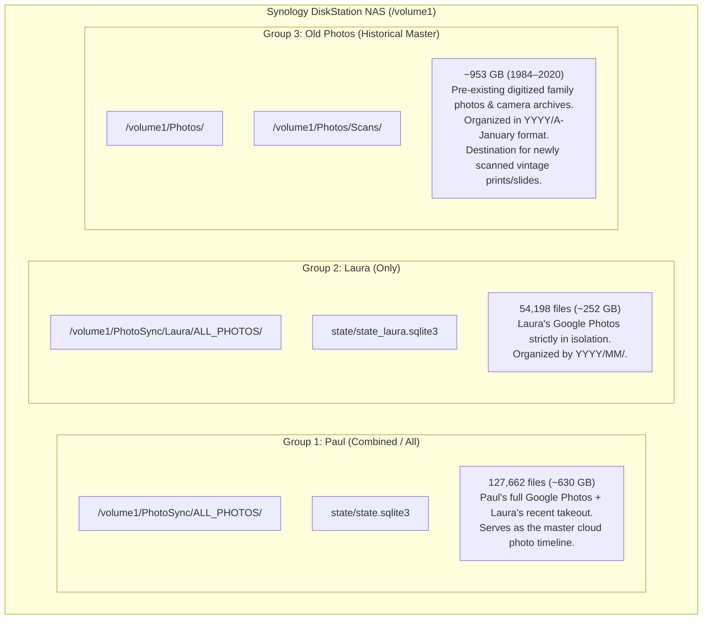
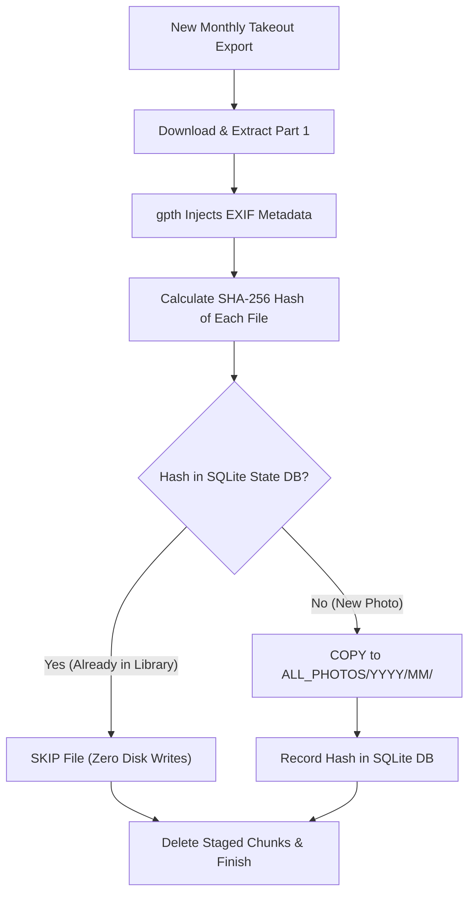

# PhotoSynApp: Google Photos Backup, Deduplication & Scanning Operations Guide

> **Author**: Paul Carff & AI Engineering Pair  
> **System**: Synology DiskStation NAS (`synology` / `10.19.5.11`)  
> **Repository**: `/workspaces_nvme/PhotoSynApp` (Local Workstation) & `~/CODE/PhotoSynApp` (Synology NAS)  
> **Operational Mode**: **Option A (Strictly Manual / On-Demand Execution)**  
> **Status**: Verified & Operational  
> **Last Updated**: September 2026  

---

## Table of Contents
1. [The Three Photo Libraries (Architecture Overview)](#1-the-three-photo-libraries-architecture-overview)
2. [Operating Policy: Why Option A (Manual On-Demand)](#2-operating-policy-why-option-a-manual-on-demand)
3. [Key Code Improvements & Bug Fixes](#3-key-code-improvements--bug-fixes)
4. [Operating Runbook: Paul's Google Photos Backup (Combined/All)](#4-operating-runbook-pauls-google-photos-backup-combinedall)
5. [Operating Runbook: Laura's Google Photos Backup (Isolated/Laura-Only)](#5-operating-runbook-lauras-google-photos-backup-isolatedlaura-only)
6. [Recurring Monthly Cycles: What Happens Next?](#6-recurring-monthly-cycles-what-happens-next)
7. [Deduplication Deep Dive: Binary Hashes vs. Image Matching](#7-deduplication-deep-dive-binary-hashes-vs-image-matching)
8. [Legacy Family Photo Scanning Guide](#8-legacy-family-photo-scanning-guide)
9. [System Maintenance, Monitoring & Troubleshooting](#9-system-maintenance-monitoring--troubleshooting)
10. [Quick Reference Cheat Sheet](#10-quick-reference-cheat-sheet)

---

## 1. The Three Photo Libraries (Architecture Overview)

Your Synology NAS is organized into **three distinct photo groups**, each serving a specific archival purpose:



### Summary of the Three Libraries

| Group | Path on NAS | Size / Files | Description & Policy |
| :--- | :--- | :--- | :--- |
| **1. Paul (All / Combined)** | `/volume1/PhotoSync/ALL_PHOTOS` | 127,662 files (~630 GB) | **Combined Master Cloud Archive**. Contains Paul's full Google Photos history plus Laura's takeout. Provides a complete, shared family timeline. Controlled by [`config/config_paul.yaml`](file:///workspaces_nvme/PhotoSynApp/config/config_paul.yaml) and `state/state.sqlite3`. |
| **2. Laura (Only)** | `/volume1/PhotoSync/Laura/ALL_PHOTOS` | 54,198 files (~252 GB) | **Laura's Dedicated Archive**. Strictly Laura's Google Photos collection in isolation. Controlled by [`config/config_laura.yaml`](file:///workspaces_nvme/PhotoSynApp/config/config_laura.yaml) and `state/state_laura.sqlite3`. |
| **3. Old Photos (Historical Master)** | `/volume1/Photos` | ~953 GB (1984–2020) | **Historical Pre-Cloud Archive**. Contains all pre-existing digitized family photos, negatives, and legacy camera collections organized by `YYYY/A-January`. Incoming physical scans will be deposited directly here under `Scans/` or `YYYY/`. |

---

## 2. Operating Policy: Why Option A (Manual On-Demand)

### 2.1 The Background Poller Discovery
During our system audit, we discovered that the background Docker container had been configured with `folder_name: "Takeout"` and `folder_id: null` on a 6-hour polling cycle. 

When Laura shared her Google Drive Takeout folder with Paul, Google Drive placed a folder named `"Takeout"` into Paul's account. In the early morning (2:11 AM), the background container woke up, queried Google Drive for any folder named `"Takeout"`, found Laura's shared folder, and ingested it into Paul's directory (`/volume1/PhotoSync/ALL_PHOTOS`).

### 2.2 The Adopted Policy: Option A
To eliminate all risk of surprise downloads, high disk usage while sleeping, or cross-folder contamination, **Option A is the official operating policy**:

1. **Background Automated Poller Disabled**:
   - The container's config ([`config/config.yaml`](file:///workspaces_nvme/PhotoSynApp/config/config.yaml)) is set to `folder_name: "DISABLED_USE_MANUAL_ON_DEMAND"` with an inactive poll interval.
   - If the Docker container is listed in **Synology DSM $\rightarrow$ Container Manager $\rightarrow$ Containers**, ensure `photosync` is **Stopped**.
2. **Dedicated Configurations for On-Demand Execution**:
   - Paul uses: [`config/config_paul.yaml`](file:///workspaces_nvme/PhotoSynApp/config/config_paul.yaml)
   - Laura uses: [`config/config_laura.yaml`](file:///workspaces_nvme/PhotoSynApp/config/config_laura.yaml)
3. **Execution Only When Takeouts Are Ready**:
   - The app is run exclusively with the `--once` flag whenever you or Laura generate an export.

---

## 3. Key Code Improvements & Bug Fixes

Before proceeding with future runs, our recent upgrades resolved four critical limitations in the original codebase:

### 3.1 Multi-Part and Multi-Batch Regex Support ([`app/takeout_group.py`](file:///workspaces_nvme/PhotoSynApp/app/takeout_group.py))
* **Problem**: Google Takeout splits large photo libraries (>50 GB) into multi-part files with compound numbering like `takeout-20260830T185305Z-1-001.zip` through `-010.zip`. The original regex only matched single-batch exports (`takeout-TIMESTAMP-PART.zip`), causing large exports to be ignored or treated as broken chunks.
* **Fix**: Updated `TAKEOUT_FILENAME_RE` to support compound sub-parts:
  ```python
  TAKEOUT_FILENAME_RE = re.compile(
      r"^(?P<export_id>takeout-\d{8}T\d{6}Z)(?:-(?P<part_info>\d+(?:-\d+)*))\.(?P<ext>zip|tgz)$"
  )
  ```
* **Result**: Accurately groups all chunks of a multi-batch export into a single unified export object.

### 3.2 Streaming Zip Extraction & Scratch Space Protection ([`app/main.py`](file:///workspaces_nvme/PhotoSynApp/app/main.py))
* **Problem**: Previously, PhotoSynApp downloaded **all** zip archives (260+ GB) before extracting them (another 260+ GB), then running `gpth` (another 260+ GB). This required **over 1.0 TB of free scratch space**, risking NAS disk exhaustion.
* **Fix**: Implemented **streaming download + immediate extraction + raw zip deletion**:
  1. Download chunk `takeout-*-001.zip`.
  2. Extract chunk into `/staging/extracted/export-id/`.
  3. Immediately delete/unlink the raw `.zip` archive.
  4. Repeat for chunks 002 through 010.
* **Result**: Peak scratch space dropped from **~850 GB down to ~270 GB**, allowing safe processing without filling the volume.

### 3.3 Strict File Permission Normalization ([`app/importer.py`](file:///workspaces_nvme/PhotoSynApp/app/importer.py))
* **Problem**: `gpth` created files with restrictive `0711` permissions, and Docker ran as `root`. Newly imported photos were completely unreadable by non-root users (`pcarff`), throwing `Permission Denied` errors in SMB file shares.
* **Fix**:
  1. Enforced `os.umask(0o002)` process-wide.
  2. In [`app/importer.py`](file:///workspaces_nvme/PhotoSynApp/app/importer.py), every imported file is explicitly set to `0664` (`rw-rw-r--`) and directories to `0775` (`rwxrwxr-x`).
  3. Excluded `*.log` and `progress.json` metadata files from being moved into the photo library.
  4. Configured DSM File Station ACL inheritance across `/volume1/PhotoSync`, guaranteeing the `users` group always retains full read/write privileges.

### 3.4 Index Archive & Crash Protection ([`app/main.py`](file:///workspaces_nvme/PhotoSynApp/app/main.py))
* **Problem**: Google Takeout creates small index archives (e.g. `takeout-20260913T143416Z-001.zip`, ~500 KB) that contain only `archive_browser.html`. Passing an archive with zero media files to `gpth` triggers exit code 12 (`InvalidTakeoutStructureException`).
* **Fix**: Added `_has_media_files(dir_path)` to inspect extracted contents before invoking `gpth`. If only HTML/JSON index files exist, it marks the export processed and skips `gpth` cleanly.

### 3.5 Multi-Config & Single-Run CLI Flags ([`app/main.py`](file:///workspaces_nvme/PhotoSynApp/app/main.py))
* Added CLI arguments:
  - `--config <path>`: Allows targeting different configuration profiles (e.g. `config_paul.yaml`, `config_laura.yaml`).
  - `--once`: Runs a single sync pass and exits cleanly.

---

## 4. Operating Runbook: Paul's Google Photos Backup (Combined/All)

Follow this runbook when Paul initiates a new Google Takeout.

### Step 1: Request Export in Google Takeout
1. Visit **[Google Takeout](https://takeout.google.com/)**.
2. Click **Deselect All**, scroll down and check **Google Photos**.
3. Click **Next Step**.
4. Delivery method: **Add to Drive**.
5. Frequency: **Export once**.
6. File type & size: **.zip**, **50 GB**.
7. Click **Create export**.

### Step 2: Confirm Files in Google Drive
* Google will notify you by email when ready.
* In Paul's Google Drive, open the **`Takeout`** folder and verify the zip files are present.

### Step 3: Run Ingestion on the NAS
Connect via SSH and run Paul's config:

```bash
ssh synology
cd ~/CODE/PhotoSynApp

# Run inside tmux or nohup
nohup ./venv/bin/python -m app.main --config config/config_paul.yaml --once > paul_sync.log 2>&1 &

# Monitor progress
tail -f paul_sync.log
```

### Step 4: Verification
Check that new photos were moved into `/volume1/PhotoSync/ALL_PHOTOS/YYYY/MM/`:
```bash
sqlite3 ~/CODE/PhotoSynApp/state/state.sqlite3 "SELECT COUNT(*) FROM library_files;"
```

---

## 5. Operating Runbook: Laura's Google Photos Backup (Isolated/Laura-Only)

Laura's library is maintained in a completely separate directory tree (`/volume1/PhotoSync/Laura`) with its own state database (`state/state_laura.sqlite3`).

### Step 1: Request Export in Laura's Google Account
1. Log into Laura's Google account at **[Google Takeout](https://takeout.google.com/)**.
2. Select **Google Photos** only.
3. Delivery method: **Add to Drive**.
4. File type & size: **.zip**, **50 GB**.
5. Click **Create export**.

### Step 2: Share Takeout Folder with Paul
1. Once ready, open Laura's Google Drive.
2. Right-click the export folder (`Takeout`) $\rightarrow$ **Share**.
3. Share with Paul's Google account (`pcarff@...`) as **Editor**.
4. From Paul's account, open **Shared with me**, open Laura's Takeout folder, and copy the **Folder ID** from the URL bar:
   `https://drive.google.com/drive/folders/<FOLDER_ID>`

### Step 3: Verify [`config/config_laura.yaml`](file:///workspaces_nvme/PhotoSynApp/config/config_laura.yaml)
Ensure `folder_id` in `~/CODE/PhotoSynApp/config/config_laura.yaml` matches the shared folder ID:
```yaml
drive:
  folder_id: "<PASTE_LAURA_FOLDER_ID_HERE>"
  token_path: "config/token.json"
```

### Step 4: Run Laura's Ingestion
```bash
ssh synology
cd ~/CODE/PhotoSynApp

# Run in background
nohup ./venv/bin/python -m app.main --config config/config_laura.yaml --once > laura_sync.log 2>&1 &

# Monitor progress
tail -f laura_sync.log
```

### Step 5: Verification
```bash
sqlite3 ~/CODE/PhotoSynApp/state/state_laura.sqlite3 "SELECT COUNT(*) FROM library_files;"
find /volume1/PhotoSync/Laura/ALL_PHOTOS -type f | wc -l
```

---

## 6. Recurring Monthly Cycles: What Happens Next?

### 6.1 Google Takeout's Export Model
Google Takeout **does not provide incremental exports**. Every export contains:
- All photos currently in Google Photos.
- All JSON sidecar metadata.
- All selected albums.

An export generated in October will contain 99% of the exact same photos that were exported in September, plus whatever new photos were taken during the month.

### 6.2 How PhotoSynApp Deduplicates the Recurring Run



1. **Smart Skip**:
   - For all previously imported photos, the calculated SHA-256 matches an entry in `state.sqlite3` (or `state_laura.sqlite3`).
   - The app logs: `Skipping already-imported file: ...`
   - **No duplicate files are created**; no extra disk space is consumed for existing photos.
2. **New Photos Only**:
   - Only the new photos taken over the preceding month have new hashes.
   - These are placed into their corresponding `YYYY/MM/` directory and their hashes are saved.

### 6.3 Handling Deletions & Manual Curation in Google Photos

> [!IMPORTANT]
> **PhotoSynApp is an Additive Archival Vault, NOT a Two-Way Sync Mirror.**

* **If a photo is deleted from Google Photos**:
  - In the next Takeout cycle, that photo will simply be absent from Google's zip.
  - **PhotoSynApp will NOT delete the photo from the Synology NAS.**
  - The photo remains safely preserved on the NAS.

* **Why this is the safest design**:
  - Two-way sync systems carry severe risks: if you accidentally delete an album in Google Photos, or if cloud trash is emptied, a two-way sync deletes your local NAS backup too.
  - An additive archive ensures that once a memory is safely on your NAS, cloud accidents cannot destroy it.

* **If you want to permanently delete a photo from the NAS**:
  - Delete it directly on the NAS (via SMB file share, macOS Finder, Windows Explorer, or Synology Photos web app).
  - Its hash remains recorded in the SQLite database, which means even if Google Takeout exports it again next month, PhotoSynApp remembers it as already handled and will not re-download or re-copy it!

---

## 7. Deduplication Deep Dive: Binary Hashes vs. Image Matching

### 7.1 What PhotoSynApp Compares: SHA-256 Binary Hash
$$\text{SHA-256}(\text{raw file bytes}) \longrightarrow \text{64-character hex string}$$

If two files have identical byte sequences, they have the identical SHA-256 hash. If even a **single bit** changes anywhere in the file (in the pixels OR in the EXIF metadata header), the SHA-256 hash changes completely.

### 7.2 The Real NAS Investigation: Why Identical Photos Differ in Hash
During our inspection of `/volume1/Photos` vs `/volume1/PhotoSync`, we compared two copies of the same photo:
- **Historical Master**: `/volume1/Photos/2019/A-January/IMG_20190124_062639.jpg` (4,882,660 bytes)
- **PhotoSync Takeout**: `/volume1/PhotoSync/ALL_PHOTOS/2019/01/IMG_20190124_062639.jpg` (4,882,697 bytes)

**Findings**:
1. **Pixel Difference**: Exactly **0 pixels differed**. The visual image was 100.0% identical.
2. **Byte Difference**: Exactly **37 bytes differed**.
3. **The Cause**: `gpth` extracted GPS coordinates and timestamps from Google's JSON sidecar file and injected them into the JPEG EXIF header.
4. **The Consequence**: Because the header gained 37 bytes of metadata, its SHA-256 hash was completely different. A pure binary hash check concluded they were two different files!

```
File A (Raw Camera Export):   [EXIF: 4KB] + [PIXELS: 4,878,660 bytes] -> Hash: a1b2c3...
File B (GPTH Injected EXIF):  [EXIF: 4KB + 37B] + [PIXELS: 4,878,660 bytes] -> Hash: d4e5f6...
                                              └── Same visual image, different file hash!
```

### 7.3 Perceptual Hashing (`pHash`) vs. Binary Hashing

| Feature | Binary Hash (SHA-256 / MD5) | Perceptual Hash (pHash / dHash) |
| :--- | :--- | :--- |
| **What it examines** | Raw byte stream (headers + metadata + data) | Discrete Cosine Transform (DCT) frequencies of image pixels |
| **Tolerance to EXIF edits** | ❌ Fails (any tag change breaks match) | ✅ 100% immune to EXIF / metadata changes |
| **Tolerance to recompression**| ❌ Fails (JPEG re-save changes bytes) | ✅ Matches if visual appearance is unchanged |
| **Tolerance to resizing** | ❌ Fails | ✅ Matches thumbnails to originals (Hamming distance $\le 5$) |
| **Computation speed** | Extremely fast (disk I/O bound) | Fast (~100–200 images/sec on CPU) |
| **Best Used For** | Rapid exact duplicate skipping in recurring Takeout runs | Cross-library deduplication between `/volume1/Photos` and `/volume1/PhotoSync` |

---

## 8. Legacy Family Photo Scanning Guide

Scanning vintage physical prints, negatives, and 35mm slides directly to the Synology NAS avoids the slow Google Takeout roundtrip and gives you full control over preservation quality.

### 8.1 Scanner Specifications & Recommendations

| Media Type | Recommended DPI | Color Mode | File Format | Notes |
| :--- | :--- | :--- | :--- | :--- |
| **Standard Photo Prints (4x6, 5x7)** | **600 DPI** | 24-bit RGB Color | JPEG (Quality 95–100%) or TIFF | 600 DPI allows clean 2x enlargement without pixelation. 300 DPI is acceptable for bulk snapshot scanning. |
| **Small Prints / Wallet Photos** | **1200 DPI** | 24-bit RGB Color | TIFF / Lossless PNG | High DPI needed to capture detail from small paper area. |
| **35mm Slides / Negatives** | **2400 to 4800 DPI** | 48-bit RGB (or 24-bit) | TIFF (16-bit) or max JPEG | Film frames are tiny (1 x 1.5 in); 2400 DPI yields ~8.5 MP; 4800 DPI yields ~34 MP. |
| **Documents / Letters / Back of Photos**| **300 DPI** | 8-bit Grayscale or RGB | PDF or JPEG | If notes are written on the back of photos, scan the back as `filename_back.jpg`. |

### 8.2 Storage Organization on the NAS

Avoid dumping all scans into a single unorganized folder. Use a dedicated scanning tree under `/volume1/Photos`:

```
/volume1/Photos/
├── 1984/ ... 2020/               <- Existing historical albums
├── Scans/                        <- Legacy Photo Scanning Root
│   ├── _Inbox/                   <- Scanner outputs directly here via SMB share
│   ├── By_Year/                  <- Photos with known or estimated years
│   │   ├── 1952/
│   │   ├── 1968-Fiocca-Wedding/
│   │   └── 1975-Summer-Vacation/
│   └── By_Decade_Unknown/        <- Photos with approximate dates
│       ├── 1950s/
│       ├── 1960s/
│       └── Undated/
```

### 8.3 The Critical "Scan Date" Pitfall & How to Fix It

> [!CAUTION]
> **Every scanner writes the CURRENT DATE (e.g. 2026-09-14) into the photo file.**  
> If you scan a photo taken in 1965, Synology Photos and Apple Photos will read the scanner's timestamp and display your grandmother's 1965 wedding under **September 2026**!

#### Method A: Batch Date Correction via Synology Photos Web UI (Easiest)
1. Open Synology Photos in your web browser (`https://synology:5001` or DSM $\rightarrow$ Synology Photos).
2. Browse to the scanned folder.
3. Select a batch of photos from the same era/year.
4. Click the **More (...)** menu in the top toolbar $\rightarrow$ **Edit date & time**.
5. Select **Shift date and time** or **Set a unified date and time** (e.g. `1974-06-15 12:00:00`).
6. Click **OK**. Synology Photos updates both its internal database and the underlying file's EXIF header.

#### Method B: Automated Date Setting via `exiftool` (Power User / CLI)
Run commands directly on the NAS to embed historical dates into files based on year or folder:

```bash
# Set an exact known date for an album
exiftool -AllDates="1968:08:24 14:00:00" -overwrite_original /volume1/Photos/Scans/1968-Fiocca-Wedding/*.jpg

# Set an approximate year (defaults to Jan 1st at noon)
exiftool -AllDates="1975:01:01 12:00:00" -overwrite_original /volume1/Photos/Scans/By_Year/1975/*.jpg

# If files are named 'YYYY-MM-DD_Description.jpg', extract the date from the filename automatically:
exiftool "-AllDates<${filename}" -overwrite_original /volume1/Photos/Scans/_Inbox/*.jpg
```

---

## 9. System Maintenance, Monitoring & Troubleshooting

### 9.1 Ensuring Docker Background Container is Stopped
To verify no background container is running:
1. Open **Synology DSM $\rightarrow$ Container Manager**.
2. Go to **Containers**.
3. If `photosync` is listed as running, select it and click **Action $\rightarrow$ Stop**.

### 9.2 Checking Storage Capacity
Ensure `/volume1` has sufficient headroom:
```bash
df -h /volume1
du -sh /volume1/PhotoSync_Staging
```

### 9.3 Refreshing the Google Drive Authentication Token
If logs show `google.auth.exceptions.RefreshError`:
```bash
# On your workstation (where a web browser is available):
cd /workspaces_nvme/PhotoSynApp
./venv/bin/python scripts/authorize.py

# Stream the refreshed token to the NAS:
cat config/token.json | ssh synology "cat > ~/CODE/PhotoSynApp/config/token.json"
```

### 9.4 Repairing File Permissions
If any photo ever becomes unreadable:
1. Open **Synology DSM $\rightarrow$ File Station**.
2. Right-click `/volume1/PhotoSync` $\rightarrow$ **Properties** $\rightarrow$ **Permission**.
3. Verify `users` has **Read & Write** checked.
4. Check **"Apply to this folder, sub-folders and files"** and click **Save**.

---

## 10. Quick Reference Cheat Sheet

| Action | Execution Command |
| :--- | :--- |
| **Run Paul's Sync (On-Demand)** | `cd ~/CODE/PhotoSynApp && nohup ./venv/bin/python -m app.main --config config/config_paul.yaml --once > paul_sync.log 2>&1 &` |
| **Run Laura's Sync (On-Demand)**| `cd ~/CODE/PhotoSynApp && nohup ./venv/bin/python -m app.main --config config/config_laura.yaml --once > laura_sync.log 2>&1 &` |
| **Check Laura's Sync Status** | `tail -f ~/CODE/PhotoSynApp/laura_sync.log` |
| **Check Paul's Sync Status** | `tail -f ~/CODE/PhotoSynApp/paul_sync.log` |
| **Query Files in Laura DB** | `sqlite3 ~/CODE/PhotoSynApp/state/state_laura.sqlite3 "SELECT COUNT(*) FROM library_files;"` |
| **Query Files in Paul DB** | `sqlite3 ~/CODE/PhotoSynApp/state/state.sqlite3 "SELECT COUNT(*) FROM library_files;"` |
| **Batch Fix Scan Dates** | `exiftool -AllDates="YYYY:MM:DD 12:00:00" -overwrite_original /path/to/photos/*.jpg` |
| **Check NAS Free Disk Space** | `df -h /volume1` |
