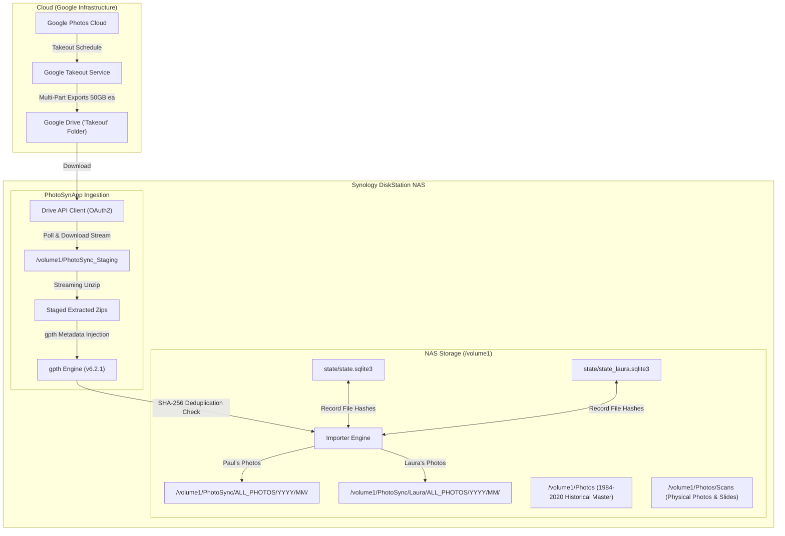
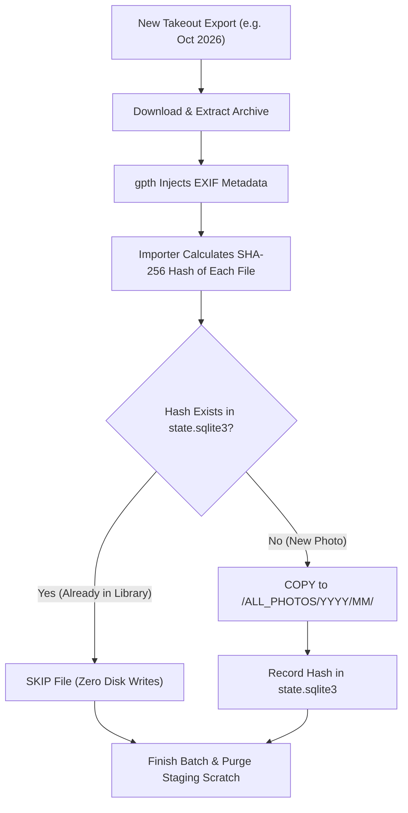

# PhotoSynApp: Google Photos Backup, Deduplication & Scanning Operations Guide

> **Author**: Paul Carff & AI Engineering Pair  
> **System**: Synology DiskStation NAS (`synology` / `10.19.5.11`)  
> **Repository**: `/workspaces_nvme/PhotoSynApp` (Local Workstation) & `~/CODE/PhotoSynApp` (Synology NAS)  
> **Status**: Verified & Operational  
> **Last Updated**: September 2026  

---

## Table of Contents
1. [System Architecture & Storage Layout](#1-system-architecture--storage-layout)
2. [Key Code Improvements & Bug Fixes](#2-key-code-improvements--bug-fixes)
3. [Operating Runbook: Paul's Google Photos Backup](#3-operating-runbook-pauls-google-photos-backup)
4. [Operating Runbook: Laura's Google Photos Backup (Isolated)](#4-operating-runbook-lauras-google-photos-backup-isolated)
5. [Recurring Monthly Cycles: What Happens Next?](#5-recurring-monthly-cycles-what-happens-next)
6. [Deduplication Deep Dive: Binary Hashes vs. Image Matching](#6-deduplication-deep-dive-binary-hashes-vs-image-matching)
7. [Legacy Family Photo Scanning Guide](#7-legacy-family-photo-scanning-guide)
8. [System Maintenance, Monitoring & Troubleshooting](#8-system-maintenance-monitoring--troubleshooting)
9. [Quick Reference Cheat Sheet](#9-quick-reference-cheat-sheet)

---

## 1. System Architecture & Storage Layout

### 1.1 End-to-End Data Flow



### 1.2 NAS Directory Structure & Responsibilities

| Path | Size / Scale | Ownership & Permissions | Role & Contents |
| :--- | :--- | :--- | :--- |
| `/volume1/Photos` | ~953 GB | `pcarff:users` (`0775`) | **Master Historical Library (1984–2020)** organized in `YYYY/A-January` format. Shared with Synology Photos. |
| `/volume1/PhotoSync/ALL_PHOTOS` | ~382 GB (86k+ files) | `root:root` / ACL `users:rwx` | **Paul's Google Photos Sync**. Flattened and organized cleanly by year/month (`YYYY/MM/filename.ext`). |
| `/volume1/PhotoSync/Laura/ALL_PHOTOS` | ~252 GB (54k+ files) | `pcarff:users` (`0775` / `0664`) | **Laura's Google Photos Sync**. Completely isolated from Paul's library. Organized by `YYYY/MM/filename.ext`. |
| `/volume1/PhotoSync_Staging` | Dynamic Scratch Space | `pcarff:users` (`0775`) | Temporary staging area where raw zips are unpacked and processed by `gpth`. Files are purged automatically after import. |
| `~/CODE/PhotoSynApp` | Application Code | `pcarff:users` (`0775`) | Local application directory on the NAS containing scripts, configs, virtual environment, and SQLite state databases. |

---

## 2. Key Code Improvements & Bug Fixes

Before continuing with recurring runs, our recent upgrades resolved four critical limitations in the original codebase:

### 2.1 Multi-Part and Multi-Batch Regex Support (`app/takeout_group.py`)
* **Problem**: Google Takeout splits large photo libraries (>50 GB) into multi-part files with compound numbering like `takeout-20260830T185305Z-1-001.zip` through `-010.zip`. The original regex only matched single-batch exports (`takeout-TIMESTAMP-PART.zip`), causing large exports to be ignored or treated as separate broken batches.
* **Fix**: Updated `TAKEOUT_FILENAME_RE` to match compound sub-parts:
  ```python
  TAKEOUT_FILENAME_RE = re.compile(
      r"^(?P<export_id>takeout-\d{8}T\d{6}Z)(?:-(?P<part_info>\d+(?:-\d+)*))\.(?P<ext>zip|tgz)$"
  )
  ```
* **Result**: Groups all chunks of a multi-batch export into a single unified export object, ensuring complete runs without missing files.

### 2.2 Streaming Zip Extraction & Scratch Space Protection (`app/main.py`)
* **Problem**: Previously, PhotoSynApp downloaded **all** zip archives (260+ GB) before extracting them (another 260+ GB), then running `gpth` (another 260+ GB). This required **over 1.0 TB of free scratch space**, risking NAS disk exhaustion.
* **Fix**: Implemented **streaming download + immediate extraction + raw zip deletion**:
  1. Download chunk `takeout-*-001.zip`.
  2. Extract chunk into `/staging/extracted/export-id/`.
  3. Immediately unlink/delete the raw `.zip` archive.
  4. Repeat for chunks 002 through 010.
* **Result**: Peak scratch space dropped from **~850 GB down to ~270 GB**, allowing safe processing on standard drives.

### 2.3 Strict File Permission Normalization (`app/importer.py` & `app/main.py`)
* **Problem**: `gpth` created files with restrictive `0711` permissions, and Docker ran as `root`. This resulted in newly imported photos being completely unreadable by non-root users (`pcarff`), throwing `Permission Denied` in SMB file shares and photo applications.
* **Fix**:
  1. Enforced `os.umask(0o002)` process-wide.
  2. In `app/importer.py`, every imported file is explicitly set to `0664` (`rw-rw-r--`) and directories to `0775` (`rwxrwxr-x`).
  3. Excluded `*.log` and `progress.json` metadata files from being moved into the photo library.
  4. Configured DSM File Station ACL inheritance (**Option A**) across `/volume1/PhotoSync`, guaranteeing the `users` group always retains full read/write privileges.

### 2.4 Index Archive & Crash Protection (`app/main.py`)
* **Problem**: Google Takeout creates small index archives (e.g. `takeout-20260913T143416Z-001.zip`, ~500 KB) that contain only `archive_browser.html`. Passing an archive with zero media files to `gpth` triggers exit code 12 (`InvalidTakeoutStructureException`), aborting the pipeline.
* **Fix**: Added `_has_media_files(dir_path)` to inspect extracted contents before invoking `gpth`. If only HTML/JSON index files exist, it safely marks the export processed and skips `gpth` cleanly.

### 2.5 Multi-Config & Single-Run CLI Flags (`app/main.py`)
* **Problem**: The app only supported a hardcoded `config/config.yaml` running in an infinite 6-hour polling loop.
* **Fix**: Added CLI arguments:
  - `--config <path>`: Allows targeting different configuration profiles (e.g. `config_laura.yaml`).
  - `--once`: Runs a single sync pass and exits cleanly, ideal for on-demand imports and cron jobs.

---

## 3. Operating Runbook: Paul's Google Photos Backup

### Step 1: Initiate Takeout in Google Account
1. Visit **[Google Takeout](https://takeout.google.com/)**.
2. Click **Deselect All**, then scroll down and check **Google Photos**.
3. (Optional) Click **All photo albums included** to select specific years/albums or leave all checked for a complete archive.
4. Click **Next Step**.
5. Delivery method: Choose **Add to Drive**.
6. Frequency: Choose **Export once** (or every 2 months if desired).
7. File type & size: Choose **.zip** and **50 GB** (reduces the total number of archives to manage).
8. Click **Create export**.

### Step 2: Confirm Files in Google Drive
* Google will take anywhere from a few hours to 24 hours to generate the archives.
* You will receive an email: *"Your Google data is ready to download"*.
* Open Google Drive and verify a folder named **`Takeout`** exists with files like `takeout-YYYYMMDDTHHMMSSZ-1-001.zip`.

### Step 3: Run the Ingestion Pipeline
Log into the Synology NAS via SSH and execute:

```bash
# 1. Connect to Synology
ssh synology

# 2. Enter code directory
cd ~/CODE/PhotoSynApp

# 3. (Recommended) Run inside tmux or nohup so SSH disconnects don't interrupt it
tmux new -s paul_sync

# 4. Run ingestion for Paul's configuration
./venv/bin/python -m app.main --config config/config.yaml --once
```

> [!NOTE]
> If you prefer to detach from `tmux`, press `Ctrl+B`, then release and press `D`. To re-attach later: `tmux attach -t paul_sync`.

### Step 4: Verify Results
Check that new photos were moved into `/volume1/PhotoSync/ALL_PHOTOS/YYYY/MM/` and that the staging directory was cleaned up:
```bash
ls -la /volume1/PhotoSync/ALL_PHOTOS/$(date +%Y)
ls -la /volume1/PhotoSync_Staging
```

---

## 4. Operating Runbook: Laura's Google Photos Backup (Isolated)

Laura's library is maintained in a completely separate directory tree (`/volume1/PhotoSync/Laura`) with its own state database (`state/state_laura.sqlite3`). This prevents any accidental mingling of collections.

### Step 1: Initiate Takeout in Laura's Google Account
1. Log into Laura's Google account at **[Google Takeout](https://takeout.google.com/)**.
2. Select **Google Photos** only.
3. Delivery method: **Add to Drive**.
4. File type & size: **.zip**, **50 GB**.
5. Click **Create export**.

### Step 2: Share Takeout Folder with Paul's Account
1. Once ready, open Laura's Google Drive.
2. Locate the folder containing the takeout archives (usually named `Takeout`).
3. **Right-click the folder $\rightarrow$ Share**.
4. Share with Paul's Google account (`pcarff@...`) with **Editor** permissions.
5. In Paul's Google Drive, open the **"Shared with me"** section, open Laura's Takeout folder, and copy the **Folder ID** from the URL bar:
   `https://drive.google.com/drive/folders/<FOLDER_ID>`

### Step 3: Verify or Update `config/config_laura.yaml`
Ensure `~/CODE/PhotoSynApp/config/config_laura.yaml` has the correct `folder_id`:

```yaml
drive:
  # Laura's shared Takeout folder ID
  folder_id: "<PASTE_LAURA_FOLDER_ID_HERE>"
  token_path: "config/token.json"

poll_interval_minutes: 360
quiet_period_minutes: 45

# Dedicated staging and library paths
staging_dir: "/volume1/PhotoSync_Staging/Laura"
library_dir: "/volume1/PhotoSync/Laura"
state_db_path: "state/state_laura.sqlite3"

gpth:
  binary_path: "bin/gpth"
  extra_args: []
```

### Step 4: Run Laura's Ingestion
Run the pipeline with the `--config` flag pointing to Laura's YAML:

```bash
ssh synology
cd ~/CODE/PhotoSynApp

# Run inside tmux or nohup
nohup ./venv/bin/python -m app.main --config config/config_laura.yaml --once > laura_sync.log 2>&1 &

# Monitor real-time progress
tail -f laura_sync.log
```

### Step 5: Post-Run Validation
Verify Laura's library:
```bash
# Count total imported photos
find /volume1/PhotoSync/Laura/ALL_PHOTOS -type f | wc -l

# Check database entries
sqlite3 ~/CODE/PhotoSynApp/state/state_laura.sqlite3 "SELECT COUNT(*) FROM library_files;"
```

---

## 5. Recurring Monthly Cycles: What Happens Next?

A common question is: *“When Laura or Paul generates the next Takeout in a month, what happens?”*

### 5.1 Google Takeout's Export Model
Google Takeout **does not provide delta/incremental exports**. Every time you request a backup, Google packages:
- All photos currently in Google Photos.
- All JSON sidecar metadata.
- All selected albums.

Therefore, an export generated in October will contain 99% of the exact same photos that were exported in September, plus whatever new photos were taken during the month.

### 5.2 How PhotoSynApp Handles the Recurring Run



1. **Detection**: The app identifies the new export timestamp (e.g. `takeout-20261014T120000Z`).
2. **Download & Process**: The archives are downloaded, unpacked, and processed by `gpth`.
3. **Smart Skip (Deduplication)**:
   - For all 54,000 previously imported photos, the calculated SHA-256 matches an entry in `state.sqlite3`.
   - The app logs: `Skipping already-imported file: ...`
   - **No duplicates are created**; no extra disk space is consumed for existing photos.
4. **New Media Import**:
   - Only the new photos taken over the preceding month have new hashes.
   - These photos are placed into the corresponding `YYYY/MM/` directory.
   - Their hashes are committed to SQLite.
5. **Purge**: The staging folder is completely wiped clean.

### 5.3 Handling Deletions & Manual Curation in Google Photos

> [!IMPORTANT]
> **PhotoSynApp is an Additive Archival Backup, NOT a Two-Way Sync Mirror.**

* **If a photo is deleted from Google Photos**:
  - In the next Takeout cycle, that photo simply will not be present in Google's zip.
  - **PhotoSynApp will NOT delete the photo from the Synology NAS.**
  - The photo remains safely preserved on the NAS in `/volume1/PhotoSync/...`.

* **Why this is the safest design**:
  - Two-way sync systems (like Google Drive desktop mirror) carry severe risks: if you accidentally delete an album in Google Photos, or if a child empties your cloud trash, a two-way sync deletes your local NAS backup too.
  - An additive archive acts as an immutable vault: once safely on the NAS, cloud deletions cannot destroy your local copy.

* **If you intentionally want to delete bad photos / duplicates from the NAS**:
  - Curate directly on the NAS (via SMB file share, macOS Finder, Windows Explorer, or Synology Photos web app).
  - Deleting a file from `/volume1/PhotoSync/ALL_PHOTOS/` removes it from disk. (Its hash remains in `state.sqlite3`, meaning even if Google Takeout exports it again next month, PhotoSynApp will remember it as already handled and will not re-download/re-copy it!).

---

## 6. Deduplication Deep Dive: Binary Hashes vs. Image Matching

### 6.1 What PhotoSynApp Currently Compares: SHA-256 Binary Hash
When PhotoSynApp imports a file, it runs:
$$\text{SHA-256}(\text{raw file bytes}) \longrightarrow \text{64-character hex string}$$

If two files have identical byte sequences, they have the identical SHA-256 hash. If even a **single bit** changes anywhere in the file (in the pixels OR in the EXIF metadata header), the SHA-256 hash changes completely.

### 6.2 The Real NAS Investigation: Why Visually Identical Files Differ

During our inspection of `/volume1/Photos` vs `/volume1/PhotoSync`, we performed a pixel-level comparison of the same photo:
- **Historical Master**: `/volume1/Photos/2019/A-January/IMG_20190124_062639.jpg` (4,882,660 bytes)
- **PhotoSync Takeout**: `/volume1/PhotoSync/ALL_PHOTOS/2019/01/IMG_20190124_062639.jpg` (4,882,697 bytes)

**Findings**:
1. **Pixel Difference**: Exactly **0 pixels differed**. The visual image was 100.0% identical.
2. **Byte Difference**: Exactly **37 bytes differed**.
3. **The Cause**: `gpth` extracted GPS coordinates, camera tags, and timestamps from Google's JSON sidecar file (`IMG_20190124_062639.jpg.json`) and injected them into the JPEG EXIF header.
4. **The Consequence**: Because the header gained 37 bytes of metadata, its SHA-256 hash was completely different. A pure binary hash check concluded they were two different files!

```
File A (Raw Camera Export):   [EXIF: 4KB] + [PIXELS: 4,878,660 bytes] -> Hash: a1b2c3...
File B (GPTH Injected EXIF):  [EXIF: 4KB + 37B] + [PIXELS: 4,878,660 bytes] -> Hash: d4e5f6...
                                              └── Same visual image, different file hash!
```

### 6.3 Perceptual Hashing (`pHash`) vs. Binary Hashing

| Feature | Binary Hash (SHA-256 / MD5) | Perceptual Hash (pHash / dHash) |
| :--- | :--- | :--- |
| **What it examines** | Raw byte stream (headers + metadata + data) | Discrete Cosine Transform (DCT) frequencies of image pixels |
| **Tolerance to EXIF edits** | ❌ Fails (any tag change breaks match) | ✅ 100% immune to EXIF / metadata changes |
| **Tolerance to recompression**| ❌ Fails (JPEG re-save changes bytes) | ✅ Matches if visual appearance is unchanged |
| **Tolerance to resizing** | ❌ Fails | ✅ Matches thumbnails to originals (Hamming distance $\le 5$) |
| **Computation speed** | Extremely fast (disk I/O bound) | Fast (~100–200 images/sec on CPU) |
| **Best Used For** | Rapid exact duplicate skipping in recurring Takeout runs | Cross-library deduplication between `/volume1/Photos` and `/volume1/PhotoSync` |

> [!TIP]
> If you wish to identify duplicates between your old master library (`/volume1/Photos`) and the new Takeout libraries, we can run a dedicated perceptual deduplication tool (like `czkawka` or a custom Python script using `imagehash`) that compares images by content rather than file bytes.

---

## 7. Legacy Family Photo Scanning Guide

Scanning vintage physical prints, negatives, and 35mm slides directly to the Synology NAS avoids the slow Google Takeout roundtrip and gives you full control over preservation quality.

### 7.1 Scanner Specifications & Recommendations

| Media Type | Recommended DPI | Color Mode | File Format | Notes |
| :--- | :--- | :--- | :--- | :--- |
| **Standard Photo Prints (4x6, 5x7)** | **600 DPI** | 24-bit RGB Color | JPEG (Quality 95–100%) or TIFF | 600 DPI allows clean 2x enlargement without pixelation. 300 DPI is acceptable for bulk snapshot scanning. |
| **Small Prints / Wallet Photos** | **1200 DPI** | 24-bit RGB Color | TIFF / Lossless PNG | High DPI needed to capture detail from small paper area. |
| **35mm Slides / Negatives** | **2400 to 4800 DPI** | 48-bit RGB (or 24-bit) | TIFF (16-bit) or max JPEG | Film frames are tiny (1 x 1.5 in); 2400 DPI yields ~8.5 Megapixels; 4800 DPI yields ~34 Megapixels. |
| **Documents / Letters / Back of Photos**| **300 DPI** | 8-bit Grayscale or RGB | PDF or JPEG | If notes are written on the back of photos, scan the back as `filename_back.jpg`. |

### 7.2 Storage Organization on the NAS

Avoid dumping all scans into a single unorganized folder. Use a dedicated scanning staging tree under `/volume1/Photos`:

```
/volume1/Photos/
├── 1984/ ... 2020/               <- Existing historical albums
├── Scans/                        <- Legacy Photo Scanning Root
│   ├── _Inbox/                   <- Scanner outputs directly here via SMB
│   ├── By_Year/                  <- Photos with known or estimated years
│   │   ├── 1952/
│   │   ├── 1968-Fiocca-Wedding/
│   │   └── 1975-Summer-Vacation/
│   └── By_Decade_Unknown/        <- Photos with approximate dates
│       ├── 1950s/
│       ├── 1960s/
│       └── Undated/
```

### 7.3 The Critical "Scan Date" Pitfall & How to Fix It

> [!CAUTION]
> **Every scanner writes the CURRENT DATE (e.g. 2026-09-14) into the photo file.**  
> If you scan a photo taken in 1965, Synology Photos and Apple Photos will read the scanner's timestamp and display your grandmother's 1965 wedding under **September 2026**!

#### Method A: Batch Date Correction via Synology Photos Web UI (Easiest)
1. Open Synology Photos in your web browser (`https://synology:5001` or DSM $\rightarrow$ Synology Photos).
2. Browse to the scanned folder.
3. Select a batch of photos from the same era/year.
4. Click the **More (...)** menu in the top toolbar $\rightarrow$ **Edit date & time**.
5. Select **Shift date and time** or **Set a unified date and time** (e.g. `1974-06-15 12:00:00`).
6. Click **OK**. Synology Photos updates both its internal database and the underlying file's EXIF header!

#### Method B: Automated Date Setting via `exiftool` (Power User / CLI)
Run commands directly on the NAS to embed historical dates into files based on year or folder:

```bash
# Set an exact known date for an album
exiftool -AllDates="1968:08:24 14:00:00" -overwrite_original /volume1/Photos/Scans/1968-Fiocca-Wedding/*.jpg

# Set an approximate year (defaults to Jan 1st at noon)
exiftool -AllDates="1975:01:01 12:00:00" -overwrite_original /volume1/Photos/Scans/By_Year/1975/*.jpg

# If files are named 'YYYY-MM-DD_Description.jpg', extract the date from the filename automatically:
exiftool "-AllDates<${filename}" -overwrite_original /volume1/Photos/Scans/_Inbox/*.jpg
```

---

## 8. System Maintenance, Monitoring & Troubleshooting

### 8.1 Monitoring an Active Sync Job
If a sync is running in the background, view live operations:
```bash
# Follow live Laura sync log:
tail -f ~/CODE/PhotoSynApp/laura_sync.log

# Check recent GPTH output logs:
ls -lt /volume1/PhotoSync/*.log
tail -f /volume1/PhotoSync/gpth_*.log
```

### 8.2 Checking Scratch & Storage Capacity
Ensure `/volume1` does not reach full capacity during large multi-part unzips:
```bash
df -h /volume1
du -sh /volume1/PhotoSync_Staging
```

### 8.3 Refreshing the Google Drive Authentication Token
Google OAuth2 refresh tokens can expire or be invalidated after extended inactivity or password changes. If logs show `google.auth.exceptions.RefreshError`:
```bash
# On your workstation (where a web browser is available):
cd /workspaces_nvme/PhotoSynApp
./venv/bin/python scripts/authorize.py

# Copy the refreshed token to the NAS:
scp config/token.json synology:~/CODE/PhotoSynApp/config/token.json
```

### 8.4 Repairing File Permissions
If any photo in `/volume1/PhotoSync` ever becomes unreadable due to permission anomalies:
1. Open **Synology DSM $\rightarrow$ File Station**.
2. Right-click `/volume1/PhotoSync` $\rightarrow$ **Properties** $\rightarrow$ **Permission**.
3. Verify `users` has **Read & Write** checked.
4. Check **"Apply to this folder, sub-folders and files"** and click **Save**.

Alternatively, run the built-in python repair tool:
```bash
cd ~/CODE/PhotoSynApp
./venv/bin/python -c "from app.importer import fix_library_permissions; fix_library_permissions('/volume1/PhotoSync')"
```

---

## 9. Quick Reference Cheat Sheet

| Action | Execution Command |
| :--- | :--- |
| **Run Paul's Sync (On-demand)** | `cd ~/CODE/PhotoSynApp && ./venv/bin/python -m app.main --config config/config.yaml --once` |
| **Run Laura's Sync (On-demand)**| `cd ~/CODE/PhotoSynApp && nohup ./venv/bin/python -m app.main --config config/config_laura.yaml --once > laura_sync.log 2>&1 &` |
| **Check Laura's Sync Status** | `tail -f ~/CODE/PhotoSynApp/laura_sync.log` |
| **Query Total Files in Laura DB** | `sqlite3 ~/CODE/PhotoSynApp/state/state_laura.sqlite3 "SELECT COUNT(*) FROM library_files;"` |
| **Query Total Files in Paul DB** | `sqlite3 ~/CODE/PhotoSynApp/state/state.sqlite3 "SELECT COUNT(*) FROM library_files;"` |
| **Batch Fix Scan Dates** | `exiftool -AllDates="YYYY:MM:DD 12:00:00" -overwrite_original /path/to/photos/*.jpg` |
| **Check NAS Free Disk Space** | `df -h /volume1` |
